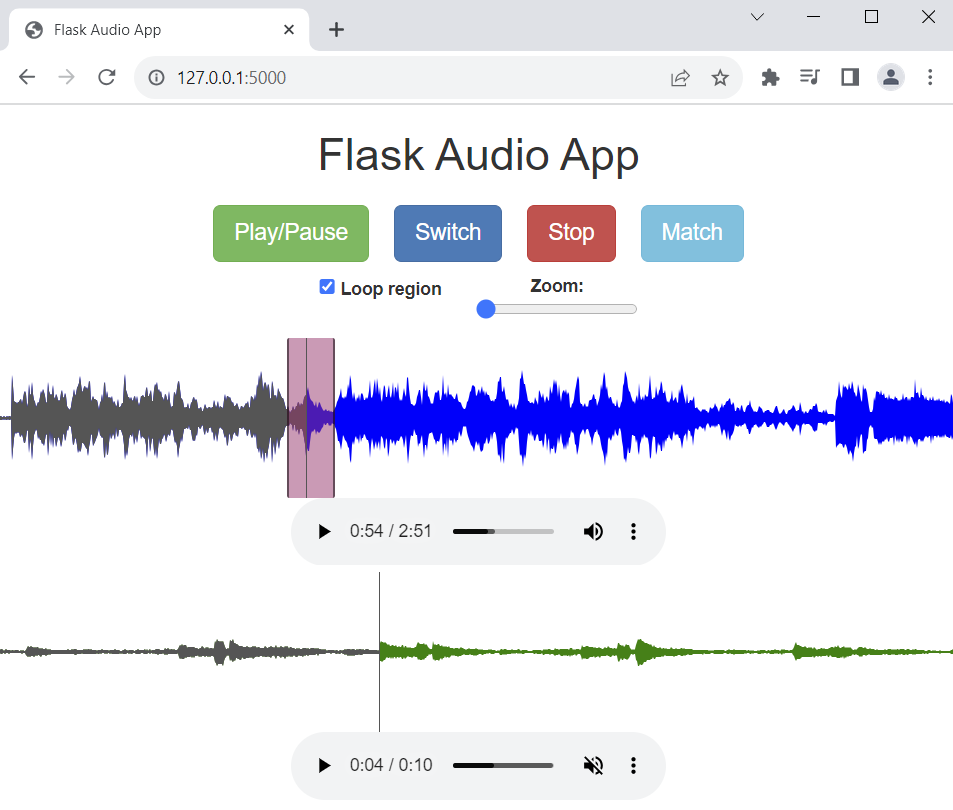

# Flask Audio App

## Description

This application enables users 
to compare two audio recordings simultaneously, meant for musicians looking to assess 
their practice sessions against a target. The app offer audio matching functionality 
to locate a practice segment within a reference recording and 
provides a visualization of the matched region.

## Installation

To set up a virtual enviroment, install dependencies and run the Flask app:

1. Clone the repository: `git clone https://github.com/ferm96/flaskaudioapp.git`
2. Create a virtual environment: `python -m venv venv` and activate it.
On Windows:
Create: `python -m venv venv`
Activate: `.\venv\Scripts\activate`
On macOS:
Create: `python3 -m venv venv`
Activate: `source venv/bin/activate`
4. Install dependencies: `pip install -r requirements.txt`
5. Set the Flask app variable:
On Windows: `set FLASK_APP=init.py`
On macOS: `export FLASK_APP=init.py`
6. Start the app: `flask run`
7. Access the app at `[http://127.0.0.1:5000](http://localhost:500)`

## Functionalities

1. Playback Controls: Play, pause, stop, and switch between audio recordings. Both are running when pressing play, the switch buttom toggles mute.
2. Matching Functionality: Click "Match" to compute and visualize the matching region between the recordings.
3. Zoom, Loop and adjust matched region: Zoom in, loop selected region, and manually adjust matching region if needed.

## Credits

- Developed by Oliwer Ferm and Mikael Kvist.

## License

Copyright 2023 KTH Royal Institute of Technology
